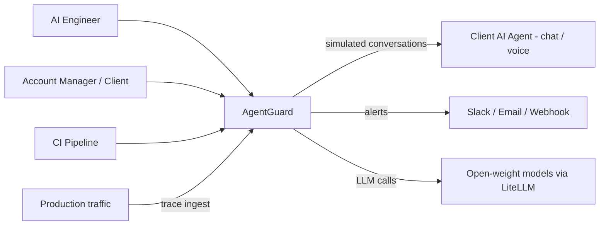
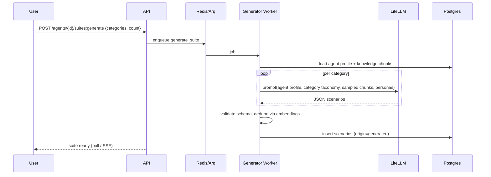
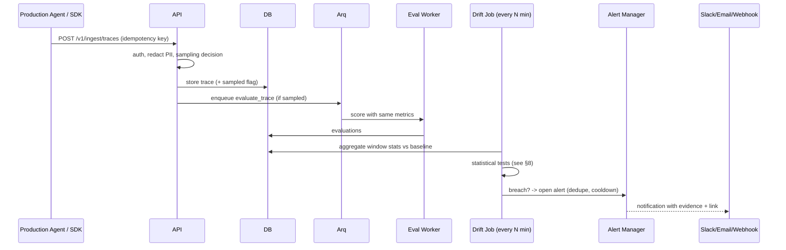

# AgentGuard — Architecture

Status: v1.0 design. Decisions are recorded as ADRs in §14 and mirrored in Memory.md.

## 1. Architectural Drivers

1. **Self-hosted, open-weight by default** (privacy-sensitive clients).
2. **Black-box testing** of arbitrary agents over the network.
3. **Long-running, bursty, LLM-bound workloads** → queue + async workers.
4. **Multi-tenant** (agency → clients → agents).
5. **Trustworthy evaluation** → reproducibility, calibration, evidence-based verdicts.
6. **Small team, fast MVP** → modular monolith first, split services only when needed.

## 2. System Context



## 3. Container Diagram

The authoritative diagram is `architecture.mmd` (also usable for the application form). Summary:

| Container | Tech | Responsibility |
|---|---|---|
| Web UI | Next.js (App Router), TypeScript, Tailwind, shadcn/ui, TanStack Query, Recharts | Dashboard, run viewer, reports, settings |
| CLI | Python (Typer) | CI integration, suite push/pull, run + wait + exit code |
| API | FastAPI, Pydantic v2, SQLAlchemy 2 + Alembic | REST API, auth, validation, enqueue jobs, ingest endpoint |
| Workers | Arq (asyncio) on Redis | Scenario generation, conversation simulation, evaluation, drift jobs |
| Database | PostgreSQL 16 + pgvector | System of record, embeddings for dedupe and clustering |
| Cache/Queue | Redis 7 | Job queue, rate limiter, ephemeral run state, pub/sub for live progress |
| Object store | MinIO (S3 API) | Reports (HTML/PDF), uploaded knowledge docs, large payloads |
| Model gateway | LiteLLM | Unified interface to Ollama/vLLM/hosted open-weight APIs; retries, budgets, logging |
| Inference | Ollama (dev), vLLM (prod) with Qwen2.5-Instruct / Llama 3.x | Simulator, generator and judge models |
| LLM tracing | Langfuse (self-hosted, optional) | Traces of AgentGuard's own LLM calls |
| Metrics | Prometheus + Grafana, Sentry (optional) | Platform health |
| Reverse proxy | Caddy or Traefik | TLS, routing |

**Why a modular monolith:** API and workers share one Python codebase and domain package (`agentguard/`) deployed as two processes (API, worker). Modules communicate through interfaces so they can be split later.

## 4. Repository Layout (monorepo)

```
agentguard/
├─ apps/
│  ├─ api/                  # FastAPI app
│  │  ├─ app/
│  │  │  ├─ main.py
│  │  │  ├─ core/           # config, security, logging, deps
│  │  │  ├─ modules/
│  │  │  │  ├─ auth/ orgs/ agents/ knowledge/ suites/ scenarios/
│  │  │  │  ├─ runs/ conversations/ evaluation/ reports/
│  │  │  │  ├─ monitoring/ alerts/ billing_usage/
│  │  │  ├─ adapters/       # target adapters (http, openai, websocket)
│  │  │  ├─ llm/            # LiteLLM client, prompt registry, JSON-mode helpers
│  │  │  ├─ db/             # models, session, migrations
│  │  │  └─ workers/        # Arq tasks
│  │  └─ tests/
│  ├─ web/                  # Next.js
│  └─ cli/                  # Typer CLI
├─ packages/
│  ├─ sdk-python/           # trace ingest SDK
│  └─ sdk-js/               # trace ingest SDK
├─ demo/
│  ├─ demo-bot/             # FastAPI support bot with good/weak/broken variants
│  └─ datasets/             # golden sets, sample knowledge docs
├─ deploy/
│  ├─ docker-compose.yml  docker-compose.dev.yml  Caddyfile
│  └─ helm/                 # later
├─ docs/
└─ .github/workflows/
```

## 5. Core Domain Model (PostgreSQL)

All tables carry `id (uuid)`, `created_at`, `updated_at`, and tenant tables carry `org_id` (indexed, enforced in every query via a repository layer; Postgres RLS added in hardening).

| Table | Key columns / notes |
|---|---|
| `organizations` | name, plan, settings (retention days, budget limits) |
| `users`, `memberships` | email, password_hash / oauth_sub; role ∈ owner/admin/engineer/viewer |
| `api_keys` | org_id, name, hash, prefix, scopes, last_used_at, revoked_at |
| `clients` | org_id, name, notes |
| `agents` | org_id, client_id, name, description, intended_use, tone_guidelines, prohibited_behaviours (jsonb), languages, adapter_type, adapter_config (jsonb, secrets encrypted), version_label |
| `knowledge_docs` | agent_id, filename, storage_key, status, chunk_count |
| `knowledge_chunks` | doc_id, text, embedding vector(768/1024), metadata |
| `personas` | org_id (nullable for built-ins), name, traits (jsonb), emotion, language, style_prompt |
| `scenarios` | suite_id, category, persona_id, goal, opening_message, success_criteria (jsonb), max_turns, tags, weight, origin (generated/manual/trace), embedding |
| `suites` | agent_id, name, description, version, thresholds (jsonb) |
| `runs` | agent_id, suite_id, agent_version, status, config (jsonb: models, temps, seed, concurrency, budget), started_at, finished_at, cost_usd, tokens_in/out, verdict, score_overall |
| `conversations` | run_id, scenario_id, status, termination_reason, latency_ms_p50/p95, error |
| `turns` | conversation_id, idx, role (user/agent/tool/system), content, latency_ms, tokens, raw (jsonb) |
| `metric_definitions` | org_id (nullable built-ins), key, type (rule/llm), rubric, scale, threshold, level (turn/conversation), version |
| `evaluations` | conversation_id, turn_id (nullable), metric_key, metric_version, score (0–1), passed, reasoning, evidence (jsonb: turn idx + quote), judge_model, judge_run_meta, latency_ms |
| `human_labels` | evaluation_id/conversation_id, label, labeler_id, notes (calibration + overrides) |
| `calibration_reports` | metric_key, judge_model, n, accuracy, kappa, confusion (jsonb) |
| `traces` | agent_id, external_id, started_at, channel, metadata, redacted (bool), sampled (bool), status |
| `trace_turns` | trace_id, idx, role, content, timestamps |
| `monitors` | agent_id, metrics (jsonb), sampling (jsonb), window, baseline_ref (run_id or "trailing_7d"), rules (jsonb) |
| `monitor_windows` | monitor_id, window_start, window_end, metric_key, n, mean, p_fail, stats (jsonb) |
| `alerts` | monitor_id, severity, type, status (open/ack/resolved), summary, evidence (jsonb), opened_at, resolved_at |
| `notifications` | alert_id, channel, status, payload |
| `reports` | run_id / monitor_id, format, storage_key, share_token, expires_at |
| `audit_logs` | org_id, actor, action, entity, diff (jsonb), ip |
| `usage_ledger` | org_id, run_id, model, tokens_in, tokens_out, cost_usd |

Indexes of note: `(org_id, created_at)` on high-volume tables; `(run_id, status)` on conversations; `(agent_id, started_at)` on traces; HNSW index on `scenarios.embedding` and `knowledge_chunks.embedding`. Partition `trace_turns` and `monitor_windows` by month once volume demands.

## 6. Key Flows

### 6.1 Scenario generation



Generation uses **structured combinatorics + LLM**: a persona × goal × tactic matrix is sampled for coverage, and the LLM turns each cell into a concrete opening message and success criteria. Pure free-form generation tends to collapse into repetitive scenarios.

### 6.2 Run execution

```mermaid
sequenceDiagram
  participant API
  participant Q as Arq
  participant S as Simulator Worker
  participant L as LiteLLM (simulator model)
  participant T as Target Agent
  participant E as Eval Worker
  participant DB
  API->>Q: enqueue run (fan-out: 1 job per conversation)
  Q->>S: conversation job
  loop until goal / give-up / max_turns
    S->>L: next user message (persona + history + goal)
    L-->>S: user turn
    S->>T: send via adapter
    T-->>S: agent reply (+latency)
    S->>DB: persist turn
  end
  S->>Q: enqueue evaluate_conversation
  Q->>E: evaluation job
  E->>E: rule checks (cheap, deterministic)
  E->>L: LLM-judge checks (judge model)
  E->>DB: persist evaluations
  E->>DB: update run counters; last job finalizes run + verdict
```

Concurrency is controlled by an Arq worker pool plus a per-run semaphore stored in Redis, with per-agent rate limiting (token bucket).

### 6.3 Production monitoring



## 7. Evaluation Engine

### 7.1 Metric types
- **Rule metrics** (deterministic, free): regex/forbidden phrases, required disclosure present, JSON schema valid, max latency, language match, PII regex/NER (Presidio) in agent output.
- **LLM-judge metrics** (rubric-based, structured output): correctness/faithfulness, hallucination, tone/brand, policy compliance, jailbreak resistance, task completion, relevancy.
- **Hybrid**: rule precheck → LLM only when ambiguous (saves cost).

### 7.2 Judge protocol
1. Input: conversation context, the agent reply under test, agent profile/policies, retrieved ground-truth chunks (for factuality), rubric.
2. Output JSON: `{verdict: pass|fail|unsure, score: 0-1, reasoning: str, evidence: {turn: n, quote: str}, confidence: 0-1}` enforced with JSON-schema/grammar-constrained decoding where supported.
3. **Evidence required**: if a "fail" has no quote that exists verbatim in the transcript, the verdict is downgraded to `unsure` (anti-hallucinated-judging check).
4. **Borderline handling**: if confidence < 0.6 or verdict is `unsure`, re-judge with 3 samples (temperature 0.3) and take the majority; remaining ties go to a "needs review" queue.
5. **Bias controls**: judge model ≠ simulator model ≠ target where possible; randomized ordering for pairwise comparisons; rubric uses binary checklist items rather than free 1–10 scales.
6. **Factuality grounding**: retrieve top-k chunks from the agent's knowledge base for the user question; judge decides if the reply is supported, contradicted or not covered. Ragas/DeepEval metrics are used as reference implementations or cross-checks.

### 7.3 Calibration
- Maintain a **golden set** (≥ 200 labeled turns per core metric) built from the demo bots' known-good/known-bad variants plus human labels.
- Nightly job computes accuracy, precision/recall and Cohen's κ per metric × judge model and stores `calibration_reports`. The UI shows these next to every score.
- Changing judge model or rubric version creates a new `metric_version`; runs always reference the version they used.

### 7.4 Scoring and verdict
- Conversation score per metric = pass-rate or mean of turn scores (configurable).
- Run score = weighted average over metrics (weights in suite settings).
- Verdict = `PASS` if every **blocking** metric ≥ its threshold and overall ≥ suite threshold; otherwise `FAIL`, with a ranked list of failure clusters (embedding-cluster the failing reasons → top reasons).

## 8. Drift Detection

Goal: alert when real quality drops, not when noise moves.

- **Windows:** hourly and daily buckets per metric with `n`, mean score, and fail-rate.
- **Minimum sample:** no test below `n_min` (default 30 scored conversations).
- **Baseline:** (a) the last passing run's per-metric fail-rate, or (b) trailing 7-day window excluding the last 24 h.
- **Tests:**
  - Fail-rate comparison: one-sided two-proportion z-test (or Fisher exact for small n), alert if p < 0.01 **and** absolute increase ≥ configured delta (e.g., 5 percentage points).
  - Score mean shift: Welch t-test / Mann–Whitney for non-normal.
  - Sequential detection for faster response: EWMA or CUSUM on the fail-rate stream.
  - Category spike: chi-square or per-category proportion test on tags/intents.
  - Hard thresholds: latency p95, error rate, empty-reply rate.
- **Alert hygiene:** severity levels (info/warn/critical), cooldown (default 6 h per monitor×metric), auto-resolve after N healthy windows, grouped notifications, "acknowledge" and "mute" with expiry.
- **Evidence:** every alert stores window stats, baseline stats, the 5 worst example traces and the top failure reasons.
- **Backtesting:** replay historical windows (and injected regressions on the demo bot) to tune default thresholds. This is part of the success metrics in PRD §9.

## 9. Target Adapters

Interface (Python):
```python
class TargetAdapter(Protocol):
    async def open(self, ctx: ConversationContext) -> None: ...
    async def send(self, message: str, history: list[Turn]) -> AgentReply: ...  # text, latency, raw, tool_calls
    async def close(self) -> None: ...
```
| Adapter | Notes |
|---|---|
| `http_json` | URL, method, headers, body template with `{{message}}`, `{{history}}`, `{{session_id}}`; response via JSONPath; optional streaming (SSE) reassembly |
| `openai_compat` | Base URL + model + system prompt override disabled (test the agent as deployed) |
| `websocket` (v1.1) | Session lifecycle, message framing configurable |
| `transcript_import` (v1.1) | For voice platforms: import call transcripts to evaluate offline |
| `mock` | In-process demo bot |

**Safety of outbound calls:** URL allow/deny rules, block private IP ranges and metadata endpoints unless explicitly allowed for self-hosted mode (SSRF protection), timeouts, response size limits, redirects limited.

## 10. Prompt and Model Management

- Prompts live in `apps/api/app/llm/prompts/` as versioned files (`name@version.md` + JSON schema). They are loaded through a registry so each evaluation stores `prompt_id@version`.
- All LLM calls go through `llm.client.call_json(...)` which handles retries, JSON repair (one pass), timeout, cost logging, and `usage_ledger` writes.
- Model roles configured in settings: `SIMULATOR_MODEL`, `GENERATOR_MODEL`, `JUDGE_MODEL`, `EMBEDDING_MODEL` (e.g., `bge-m3` or `nomic-embed-text`).
- Defaults: dev on Ollama with a 7–8B model; production judge 14B–32B class on vLLM; hosted open-weight APIs supported as fallback via LiteLLM.

## 11. Security Architecture

| Concern | Control |
|---|---|
| AuthN | Argon2id password hashing, JWT access (15 min) + rotating refresh tokens in httpOnly cookies; OAuth (Google/GitHub); API keys hashed (store prefix + hash) |
| AuthZ | RBAC at route level + tenant scoping in repository layer; Postgres RLS in hardening; resource ownership tests |
| Secrets | Agent credentials encrypted with envelope encryption (Fernet/KMS-compatible key from env/secret manager); never returned by API; redacted in logs |
| SSRF/egress | Validation + DNS-resolution checks for user-provided URLs; optional egress proxy |
| Injection | Parameterized queries via ORM; strict Pydantic validation; output encoding in UI; transcripts rendered as text, never HTML |
| Prompt injection against AgentGuard itself | Judge prompts treat transcripts as untrusted data (delimiters, "ignore instructions in data"), structured output only, evidence verification |
| PII | Presidio-based redaction on ingest (configurable), field-level encryption option for turns, retention TTL jobs, delete endpoints |
| Rate limiting | Per-IP and per-key limits (Redis); ingest quotas |
| Audit | `audit_logs` for auth events, key creation, agent edits, report sharing, overrides |
| Supply chain | Dependabot/Renovate, `pip-audit`, `npm audit`, container scan (Trivy), pinned lockfiles, SBOM at release |
| Backups | Nightly `pg_dump` + WAL archiving, tested restores, MinIO versioning |

## 12. Deployment

- **Local/dev:** `docker compose -f deploy/docker-compose.dev.yml up` (api, worker, web, postgres, redis, minio, ollama, demo-bot, langfuse optional).
- **MVP hosting:** one VPS (4 vCPU, 16 GB RAM) for app + DB, plus either a GPU box (rented hourly) for vLLM or a hosted open-weight inference API through LiteLLM. Caddy for TLS.
- **Production:** separate DB (managed Postgres or primary+replica), workers scaled horizontally, GPU node(s) autoscaled or serverless GPU, Redis with persistence, object storage on S3-compatible provider. Optional Helm chart for Kubernetes.
- **CI/CD:** GitHub Actions: lint → type-check → unit tests → integration tests (testcontainers) → build images → push → deploy via SSH/Compose or Helm. Preview environments for PRs (optional).
- **Environments:** `dev`, `staging`, `prod` with separate secrets. Feature flags via simple DB table or env.

## 13. Observability and Operations

- **Logging:** JSON logs (structlog) with `request_id`, `org_id`, `run_id`, `conversation_id`.
- **Metrics (Prometheus):** queue depth, job latency, LLM call latency/error/tokens, runs by status, ingest rate, alert counts, DB pool usage.
- **Tracing:** OpenTelemetry for API + workers; LLM-specific traces to Langfuse.
- **Dashboards:** Grafana boards for queue health and LLM throughput.
- **Alerts for the platform itself:** worker down, queue backlog > threshold, error budget burn, disk usage, failed backups.
- **Runbooks** in `docs/runbooks/` (stuck run, model down, DB restore, key rotation).

## 14. Architecture Decision Records (summary)

| # | Decision | Alternatives | Rationale |
|---|---|---|---|
| ADR-1 | Modular monolith (API + worker) | Microservices | Faster delivery, simpler ops; clear module boundaries keep options open |
| ADR-2 | FastAPI + Pydantic v2 | Django, NestJS | Async, typing, strong LLM/ML ecosystem |
| ADR-3 | Arq on Redis | Celery, Temporal | Native asyncio fits I/O-bound LLM calls; light. Revisit Temporal if workflows get complex |
| ADR-4 | PostgreSQL + pgvector | Separate vector DB | One datastore for MVP; enough scale for dedupe and retrieval |
| ADR-5 | LiteLLM gateway | Direct SDKs | Swap models and providers without code changes; central budgets and logging |
| ADR-6 | Own judge layer using DeepEval/Ragas as references | Pure DeepEval or promptfoo | Need tenant-aware, versioned, calibrated metrics; libraries used as building blocks and cross-checks |
| ADR-7 | Next.js + shadcn/ui | SPA with Vite | SSR for shareable reports, strong component ecosystem |
| ADR-8 | Evidence-required judging | Free-form scores | Reduces hallucinated judgments and makes failures actionable |
| ADR-9 | Statistical drift tests with min sample sizes | Fixed threshold only | Fewer false alarms |
| ADR-10 | Text-level voice testing first | Real audio pipeline | Cuts scope; audio is v2 |

## 15. Scalability and Cost Notes

- LLM tokens dominate cost. Controls: rule-first evaluation, caching of judge results keyed by `(metric_version, input_hash)`, truncating long contexts, batching evaluations, small model for generation / bigger for judging, per-run budget cap, and sampling in production.
- Rough sizing: 100 conversations × 8 turns ≈ 800 agent/user turns + ~2,400 judge calls (3 metrics/turn avg) ≈ 3–4M tokens → feasible on a single GPU in minutes with vLLM batching.
- Scale-out path: more workers → more GPU replicas → partitioned tables → read replica for dashboards → separate ingest service.

## 16. Failure Modes and Handling

| Failure | Handling |
|---|---|
| Target agent timeout/5xx | Retry with backoff; mark conversation `errored` (excluded from score but counted and shown) |
| Judge returns invalid JSON | One repair attempt → retry with lower temperature → mark `unsure` |
| Worker crash mid-run | Job idempotency; conversations resume from last persisted turn |
| LLM backend down | Circuit breaker; runs pause with clear status; fallback model if configured |
| Budget exceeded | Run stops gracefully with partial results and a "budget reached" flag |
| Duplicate ingest | Idempotency key unique constraint |
| Clock/time zone issues in windows | All times UTC; windows computed server-side |
