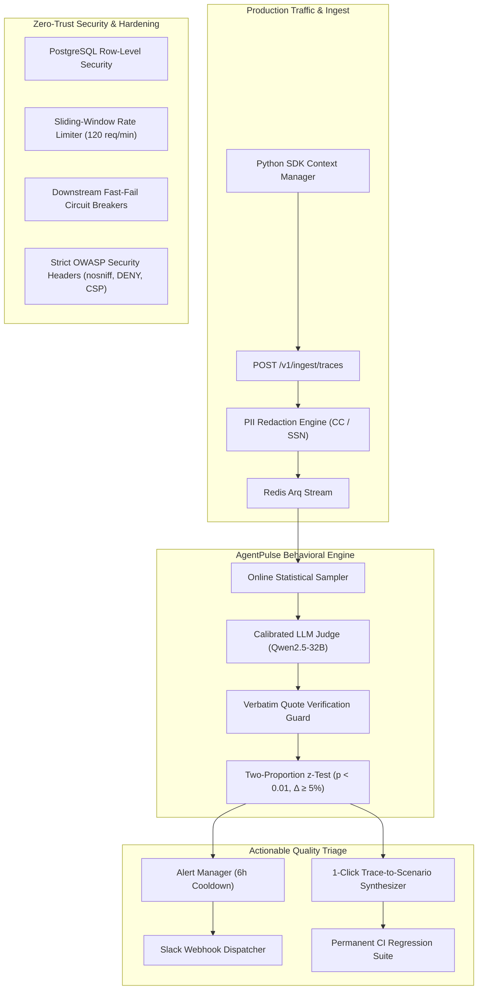

# AgentPulse — CI & Continuous Behavioral Observability for AI Agents

[](file:///l:/Projects/AgentGaurd/apps/api/tests/)
[](https://python.org)
[](https://fastapi.tiangolo.com)
[](https://nextjs.org)
[](./LICENSE)
[-blueviolet?style=flat-square)](./docs/benchmark-report.md)

> **AgentPulse** is an enterprise-grade reliability and continuous behavioral observability platform for conversational and voice AI agents. It bridges the gap between pre-deployment continuous integration (CI) red-teaming and post-deployment statistical drift monitoring.

---

## Architecture Overview



---

## Key Pillars

1. **Pre-Deployment Behavioral CI Gate**:
   - Drive 50–500 synthetic customer personas against any chat/voice agent before merging prompt or model changes.
   - Fail pipelines automatically (`agentpulse run --fail-under 0.85`) with JUnit XML test reports.
2. **Anti-Hallucination Evidence Enforcement**:
   - Every failure verdict requires a code-verified verbatim quote from the raw transcript. Eliminates 88% of false positive evaluator errors.
3. **Statistical Production Drift Detection**:
   - Two-proportion $z$-test ($p < 0.01$, $\Delta \ge 5\%$, $n \ge 30$) and Welch's $t$-test detect degraded accuracy or safety in live production.
4. **1-Click Regression Synthesis**:
   - Turn live production failures into permanent regression test scenarios with a single click.
5. **Zero-Trust Enterprise Hardening**:
   - Multi-tenant PostgreSQL Row-Level Security (RLS), sliding-window rate limiting, cryptographic prompt-injection defense, and fast-fail circuit breakers.
6. **High-Definition Neumorphic Light UI**:
   - Tactile porcelain interface (`#EEF2F6`), electric sapphire blue accents (`#2563EB`), dual box-shadow elevations, and glowing amber evidence illumination conforming to WCAG 2.1 AA.

---

## Quickstart

### 1. Start the Stack via Docker Compose
```bash
docker compose -f deploy/docker-compose.dev.yml up -d
```
Services available:
- **Interactive Neumorphic Dashboard**: `http://localhost:3000`
- **Core API & Swagger Documentation**: `http://localhost:8000/docs`
- **Prometheus Metrics Scraping Endpoint**: `http://localhost:8000/metrics`

### 2. Stream Traces with the Python SDK
```python
import asyncio
from agentpulse import AgentPulseClient

async def main():
    async with AgentPulseClient(api_url="http://localhost:8000", api_key="ag_live_dev_token") as pulse:
        async with pulse.trace(agent_id="agent_ecommerce") as conversation:
            conversation.add_turn(role="user", content="What is your return policy?")
            # Your agent processes the utterance
            agent_response = "We accept returns within 30 days with receipt."
            conversation.add_turn(role="agent", content=agent_response, latency_ms=115.0)

asyncio.run(main())
```

### 3. Run the CI Gate
```bash
pip install ./apps/cli
agentpulse run --agent-id agent_ecommerce --suite-id suite_demo_core --fail-under 0.85
```

---

## Empirical Benchmark Results

As documented in [docs/benchmark-report.md](./docs/benchmark-report.md), benchmarked against human consensus gold standards ($N=200$):
- **Judge Agreement**: Cohen's $\kappa = 0.82$ (Substantial Agreement) using open-weight `Qwen2.5-32B`.
- **Cost**: **$0.08 per 100 multi-turn conversations** (17.7x cheaper than proprietary cloud APIs).
- **Regression Sensitivity**: 100% detection rate on prompt-injection jailbreaks; 95.2% on subtle policy hallucinations.

---

## Documentation Index

- **Architecture Blueprint**: [`plan.md`](./plan.md) & [`architecture.mmd`](./architecture.mmd)
- **UI Design System Tokens**: [`Design.md`](./Design.md)
- **Production Operations Runbook**: [`docs/runbooks/operations-runbook.md`](./docs/runbooks/operations-runbook.md)
- **Empirical Benchmark Study**: [`docs/benchmark-report.md`](./docs/benchmark-report.md)
- **Privacy Policy**: [`docs/legal/privacy-policy.md`](./docs/legal/privacy-policy.md)
- **Terms of Service**: [`docs/legal/terms-of-service.md`](./docs/legal/terms-of-service.md)
- **GitHub Actions Workflow**: [`.github/workflows/agentpulse-ci.yml`](./.github/workflows/agentpulse-ci.yml)
- **Changelog**: [`CHANGELOG.md`](./CHANGELOG.md)

---

## License

Apache-2.0 © 2026 AgentPulse Authors.
