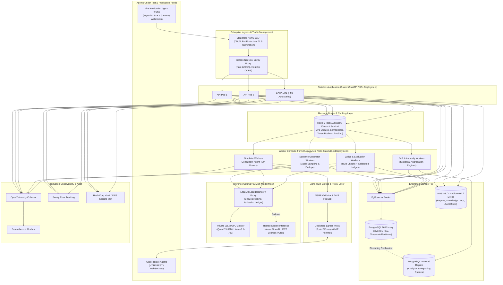

# AgentGuard (Enterprise Grade) — Master Production Architecture & Implementation Plan

> **Document Type:** Production-Grade Engineering Master Blueprint & Roadmap  
> **System Scope:** Enterprise Multi-Tenant AI Agent Behavioral Testing, Quality Gate (CI) & Uptime Drift Observability  
> **Target Release:** Production v1.0 (Enterprise Ready)  
> **Operational Stance:** Zero-Trust Security · Multi-Tenant Isolated · Highly Available · Compliance-Aligned (SOC2 Type II / HIPAA Posture)  
> **Associated Specs:** [PRD.md](file:///l:/Projects/AgentGaurd/PRD.md) · [Architecture.md](file:///l:/Projects/AgentGaurd/Architecture.md) · [Design.md](file:///l:/Projects/AgentGaurd/Design.md) · [Rules.md](file:///l:/Projects/AgentGaurd/Rules.md) · [Tasks.md](file:///l:/Projects/AgentGaurd/Tasks.md) · [architecture.mmd](file:///l:/Projects/AgentGaurd/architecture.mmd)

---

## 1. Executive Vision & Production Mandate

**AgentGuard** is an enterprise-grade reliability and observability platform for conversational and voice AI agents. It operates in two unified cycles:

1. **Pre-Deployment Behavioral Quality Gate (CI/CD):** Black-box simulation executing hundreds of adversarial, edge-case, and domain-specific customer journeys against candidate agents, enforcing strict regression and compliance thresholds before code or prompt promotion.
2. **Post-Deployment Real-Time Drift Observability:** Ingestion of live multi-channel production conversations, continuous automated evaluation, rigorous statistical drift detection, anomaly alerting, and instant synthesis of real-world failures into repeatable regression suites.

### Core Value Metrics for Production SLA/SLO
* **Testing Throughput:** 500-conversation multi-turn suites executed and scored in under 12 minutes on clustered workers.
* **Evaluation Fidelity:** Calibrated LLM judges achieving Cohen's $\kappa \ge 0.75$ against human consensus golden sets with mandatory transcript quote verification.
* **Drift Responsiveness:** Statistical detection of behavioral degradation ($\ge 5\%$ shift) within 100 scored production traces with $< 1$ false alert per week.
* **Enterprise Availability:** Core ingestion API availability target of 99.95%, p95 ingestion latency $< 150\text{ ms}$, p95 dashboard load time $< 1.5\text{ s}$.
* **Data Sovereignty:** 100% self-hostable in VPC/on-premise environments with zero customer data egress, supporting local open-weight inference (vLLM / Qwen2.5 / Llama 3).

---

## 2. Brand Positioning & Production Name Candidates

For commercial SaaS ventures and enterprise agencies, naming dictates credibility, market positioning, and trademark defensibility. Below are curated production-tier candidates:

| Name Candidate | Brand Angle | Market Positioning & Rationale |
|---|---|---|
| **AgentPulse** *(Top Pick)* | High-Tech Observability | Evokes real-time health, vital signs, and live uptime monitoring. Premium, modern SaaS vibe comparable to Datadog or Sentry. |
| **VigilAI** / **AgentVigil** | Security & Assurance | Conveys non-stop vigilance, proactive protection, and enterprise compliance. Highly memorable, professional for regulated clients. |
| **CertiAgent** | Automated QA / Certification | Positioned as the official "quality certification seal" for agents. Agencies can pitch: *"All our bots are CertiAgent certified."* |
| **AgentSentry** | DevOps / CI Governance | Speaks directly to AI engineers and CI/CD pipeline automation. Natural association with automated regression blocking. |
| **TrustAgent** | Enterprise Trust & Safety | Emphasizes factuality, anti-hallucination, and policy compliance for healthcare, banking, and legal AI workflows. |
| **ValidaAI** | Clean, Minimalist Enterprise | Short, international, punchy SaaS brand (Latin root *validus* = strong, valid). High domain and enterprise software appeal. |

---

## 3. Production Enterprise Architecture

### 3.1 Distributed High-Availability Topology

The production architecture deploys a stateless application tier behind an API gateway/WAF, backed by asynchronous worker pools auto-scaled on Redis queue depth, resilient database clusters with read replicas, and isolated inference gateways.



---

### 3.2 Production Component Specifications

| Architectural Domain | Production Technology | Configuration & SLA Standards |
|---|---|---|
| **API Runtime** | FastAPI 0.110+ on Python 3.12 (uvloop) | Multi-worker Gunicorn/Uvicorn pods; non-blocking async throughout; RFC 7807 problem+json error formatting; OpenAPI 3.1 automated validation. |
| **Database & Pooling** | PostgreSQL 16 + `pgvector` + PgBouncer | Row-Level Security (RLS) on all tenant tables; partition `trace_turns` and `monitor_windows` by month; connection pooling capped at 25 connections/pod. |
| **Job Queue & State** | Redis 7 Cluster (or Sentinel) | Memory max-memory eviction policy `volatile-lru`; AOF persistence with `everysec`; Arq workers with distributed Redis semaphores for run concurrency. |
| **Inference Orchestration** | LiteLLM Proxy + vLLM | Centralized router managing load balancing, automated retries with exponential backoff, circuit breaking on 5xx, and token accounting in `usage_ledger`. |
| **Object Storage** | S3-Compatible (AWS S3 / MinIO / R2) | Bucket versioning enabled; KMS-managed SSE-S3 encryption; lifecycle policies expiring raw reports after retention window. |
| **Outbound Egress Guard** | Dedicated Forward Proxy + Custom Resolver | Strict socket-level validation before HTTP dispatch; blocks private RFC 1918, loopback, link-local, and cloud metadata (`169.254.169.254`). |
| **Frontend Architecture** | Next.js 14+ (App Router), shadcn/ui, TanStack Query | Edge-ready server components; SSR for public shareable reports; client state synchronized via Server-Sent Events (SSE). |

---

## 4. Enterprise Security, Privacy & Zero-Trust Posture

### 4.1 Tenant Isolation Architecture
* **Dual-Layer Isolation:**
  1. **Application Layer:** Generic `BaseRepository[T]` enforces `org_id` filtering on every query. Routes failing to provide tenant context fail with `401 Unauthorized`.
  2. **Database Layer (RLS):** PostgreSQL Row-Level Security policies active on all tenant tables (`CREATE POLICY tenant_isolation_policy ON <table> USING (org_id = current_setting('app.current_org_id')::uuid)`).
* **Cross-Tenant Testing:** Dedicated integration suite executing automated adversarial cross-tenant requests across all endpoints in CI.

### 4.2 Cryptographic Secrets Management
* Target agent API keys and webhook secrets are encrypted at rest using **AES-256-GCM envelope encryption** with data encryption keys (DEK) protected by a master key (KEK) loaded from HashiCorp Vault or AWS KMS.
* Secrets are **write-only**: once saved, the API never returns decrypted credentials in responses.
* Zero plaintext credentials in application logs or Sentry traces (enforced via custom structlog processors).

### 4.3 Data Privacy & Compliance Safeguards
* **In-Flight PII Redaction:** Integrated Microsoft Presidio pipeline sanitizes credit cards, social security numbers, phone numbers, and names at the ingestion boundary before writing to `traces`.
* **Configurable Data Retention:** Automated background jobs purge trace turns according to organization-configured retention policies (e.g., 30, 60, or 90 days).
* **Right to be Forgotten:** Full cascade hard-deletion endpoints for GDPR/CCPA data removal requests.
* **Audit Trail:** Append-only `audit_logs` table tracking authentication, permission modifications, API key generation, agent alterations, and report sharing.

---

## 5. Enterprise Evaluation & Calibration Engineering

### 5.1 The Evidence-Required LLM-Judge Protocol

To eliminate judge hallucinations and deliver trustworthy evaluations:

```
[Candidate Agent Turn Under Evaluation] + [Ground Truth KB Chunks] + [Rubric vN]
                                  │
                                  ▼
                    [Judge LLM (JSON Mode)]
                                  │
                                  ▼
  Emits: { verdict: "pass"|"fail"|"unsure", score: 0.0-1.0, reasoning: str, evidence_quote: str }
                                  │
                                  ▼
                   [Code-Level Verbatim Quote Guard]
                                  │
            ┌─────────────────────┴─────────────────────┐
            ▼                                           ▼
[Verbatim Quote Found in Transcript]       [Quote Not Found in Transcript]
            │                                           │
   Accept Verdict                              Downgrade 'fail' to 'unsure'
            │                                  Flag as 'Unverified Evidence'
            ▼                                           │
[Confidence >= 0.70?]                                   ▼
   ├── YES ──► Finalize Score                  [Trigger 3-Sample Majority Vote]
   └── NO  ──► [Trigger 3-Sample Majority Vote]
```

### 5.2 Statistical Drift Detection Engine

Rather than relying on naive arbitrary thresholds that trigger alert fatigue, AgentGuard executes a multi-stage statistical pipeline:

1. **Sample Size Gate:** Requires minimum sample count $n \ge n_{\min}$ (default 30 scored traces) per evaluation window before executing tests.
2. **Two-Proportion Z-Test on Failure Rates:**
   $$Z = \frac{\hat{p}_1 - \hat{p}_2}{\sqrt{\hat{p}(1-\hat{p})\left(\frac{1}{n_1} + \frac{1}{n_2}\right)}}$$
   Alerts only if $p\text{-value} < 0.01$ **and** the absolute degradation $\Delta \ge 5.0\%$.
3. **Distribution Shift Testing:** Welch’s unequal variances t-test for normal distributions and Mann-Whitney U test for non-parametric score distributions.
4. **Sequential Change-Point Detection:** Exponentially Weighted Moving Average (EWMA) and CUSUM tracking sudden micro-shifts in latency, error rates, and failure frequencies.
5. **Alert Hygiene & Cooldown:** Automated deduplication, 6-hour cooldown windows per metric, and automatic resolution when metrics return to baseline across 3 consecutive windows.

---

## 6. Comprehensive Phased Production Implementation Plan

The production build follows an uncompromised 7-phase methodology with rigorous exit gates.

```
Phase 0: Production Foundations & Enterprise Monorepo (Week 1)
   │
   ▼
Phase 1: Core Testing Engine & MVP Verification (Weeks 2–3) ──► Gate: Public Demo Link
   │
   ▼
Phase 2: Production Monitoring, SDK & Alpha Drift (Weeks 4–5) ──► Gate: Automated Alert Trigger
   │
   ▼
Phase 3: Calibrated Judges, Enterprise RBAC & Beta (Weeks 6–7) ──► Gate: Cohen's κ >= 0.75
   │
   ▼
Phase 4: Security Hardening, RLS & Load Resilience (Weeks 8–9) ──► Gate: Pen-Test & Load Validated
   │
   ▼
Phase 5: Pilot Deployments, Documentation & Polish (Weeks 10–11) ──► Gate: 3 Enterprise Pilots Live
   │
   ▼
Phase 6: Production Release, Canary & Launch (Week 12) ──► Gate: 100% Production Sign-off
```

---

### Phase 0: Production Foundations & Enterprise Monorepo (Week 1, ~45h)

*Goal: Establish an enterprise-ready development and container infrastructure, database layer with RLS hooks, and automated CI pipelines.*

- [ ] **Task 0.1: Monorepo Architecture Initialization**
  - Establish `apps/api`, `apps/web`, `apps/cli`, `packages/sdk-python`, `packages/sdk-js`, `demo/demo-bot`, and `deploy/` directory tree.
  - Configure root `pyproject.toml` using `uv`, setup Poetry/pip lockfiles, and configure TypeScript monorepo tooling.
  - Author enterprise `README.md`, `LICENSE` (Apache-2.0), `.editorconfig`, `.gitignore`, and `CODEOWNERS`.
- [ ] **Task 0.2: Local & Dev Container Stack**
  - Create `deploy/docker-compose.dev.yml` provisioning PostgreSQL 16 with `pgvector`, Redis 7 with persistent volume, MinIO S3, LiteLLM gateway, and Ollama.
  - Document all configuration options in an exhaustive `.env.example` with cryptographically secure placeholders.
- [ ] **Task 0.3: FastAPI Enterprise Skeleton**
  - Setup FastAPI application in `apps/api/app/main.py` utilizing lifespan events.
  - Implement structured JSON logging (`structlog`) injecting `request_id`, `trace_id`, and `tenant_id`.
  - Implement centralized RFC 7807 `application/problem+json` exception handlers.
  - Add `/healthz`, `/livez`, and `/readyz` probes for Kubernetes integration.
- [ ] **Task 0.4: Database & Repository Tier**
  - Configure asynchronous SQLAlchemy 2.0 with `asyncpg`.
  - Initialize Alembic with async migration template supporting clean `upgrade` and `downgrade`.
  - Build `BaseRepository[Model]` with automatic `org_id` filtering and session management.
- [ ] **Task 0.5: Next.js Enterprise Frontend Skeleton**
  - Initialize Next.js 14 (App Router) in `apps/web/` with strict TypeScript.
  - Install Tailwind CSS and shadcn/ui component system.
  - Configure high-contrast, accessible dark/light theme tokens per [Design.md](file:///l:/Projects/AgentGaurd/Design.md).
- [ ] **Task 0.6: CI/CD Quality Pipeline**
  - Build GitHub Actions workflow running `ruff` (lint & format), `mypy --strict`, `pytest` (unit & integration with testcontainers), `eslint`, `tsc`, and `vitest`.
- [ ] **Task 0.7: Pre-Commit Security Hooks**
  - Install pre-commit hooks enforcing Ruff, Prettier, and `gitleaks` secret scanning.
- [ ] **Task 0.8: LiteLLM Multi-Model Gateway Client**
  - Implement `apps/api/app/llm/client.py` wrapping LiteLLM.
  - Add exponential backoff retries, JSON validation/repair, timeout controls, and token usage auditing to `usage_ledger`. Provide in-memory mock client for tests.

**Phase 0 Exit Gate:** Complete CI pipeline runs green on `main`; fresh developer clone starts via single `docker compose up` command.

---

### Phase 1: Core Testing Engine & MVP Verification (Weeks 2–3, ~90h)

*Goal: Deliver the end-to-end testing loop: register agent, generate 50 scenarios, run simulation, evaluate with evidence verification, and view scorecard.*

#### 1A. Tenancy, Organizations & Security
- [ ] **Task 1.1:** Build Organization, User, and Membership domain models with Argon2id password hashing and rotating JWT access/refresh cookies.
- [ ] **Task 1.2:** Build API Key service supporting SHA-256 hashed keys with prefixes (`ag_live_...`), scopes, and single-reveal modal.
- [ ] **Task 1.3:** Create database seeding script generating sample agency organization, demo agent, and realistic pre-calculated run scorecards.

#### 1B. Agent Management & Outbound Adapters
- [ ] **Task 1.4:** Build Agent management APIs (CRUD, tone guidelines, intended use, prohibited behaviors).
- [ ] **Task 1.5:** Implement `TargetAdapter` protocol supporting `http_json` (configurable body templates, headers, JSONPath extraction) and `openai_compat`. Implement Fernet secret encryption and socket-level SSRF validation blocking private IPs.
- [ ] **Task 1.6:** Implement bundled multi-mode `demo-bot` (FastAPI) featuring switchable behavioral profiles: `good`, `weak-safety`, `hallucinating`, and `rude`.
- [ ] **Task 1.7:** Implement Knowledge Document pipeline: upload PDF/MD/TXT, chunk text (500 tokens, 50 overlap), generate embeddings via `bge-m3` or `text-embedding-3-small`, and index into `pgvector`.

#### 1C. Synthetic Scenarios & Suite Generation
- [ ] **Task 1.8:** Create curated library of 20+ base user personas and 10 category taxonomies (happy path, confused, angry, off-topic, jailbreak, PII extraction, policy edge cases, memory, long context, multilingual).
- [ ] **Task 1.9:** Implement Scenario Generator worker (`generate_suite` Arq task). Samples Persona × Goal × Tactic matrix, generates structured scenarios via LLM in JSON mode, validates schema, and deduplicates using vector cosine distance ($> 0.92$ similarity dropped).
- [ ] **Task 1.10:** Implement Suite and Scenario management endpoints with YAML/JSON import and export.

#### 1D. Multi-Turn Simulation & Orchestration
- [ ] **Task 1.11:** Build Run Orchestration service. Dispatches conversation simulation jobs to Arq, enforces per-agent concurrency via Redis semaphores, controls token buckets, monitors budget limits, and handles cancellations.
- [ ] **Task 1.12:** Implement Conversation Simulator worker (`simulate_conversation` Arq task). Manages multi-turn user/agent exchanges with termination triggers (goal achieved, give-up, max turns), capturing per-turn latency and raw payloads.
- [ ] **Task 1.13:** Implement Server-Sent Events (SSE) streaming endpoint (`GET /v1/runs/{id}/stream`) emitting real-time run progress, completed conversations, cost, and latency.

#### 1E. Evaluation Engine & Calibrated Judging
- [ ] **Task 1.14:** Implement Evaluator Registry and deterministic rule evaluators: regex scanners, forbidden phrase detectors, JSON schema checkers, max latency limits, and language matchers.
- [ ] **Task 1.15:** Implement LLM-Judge framework. Queries judge models using structured output rubrics, verifies evidence quotes exist verbatim in transcripts, and triggers 3-sample majority voting on borderlines.
- [ ] **Task 1.16:** Implement built-in core judged metrics: Correctness/Faithfulness (with KB chunk retrieval), Hallucination, Tone/Brand, Policy Compliance, Safety/Jailbreak, and Task Completion.
- [ ] **Task 1.17:** Implement Run Scoring & Verdict Engine. Computes weighted category scores, evaluates blocking metric pass/fail thresholds, and clusters failure reasons via embeddings.

#### 1F. Frontend User Experience
- [ ] **Task 1.18:** Construct App Layout, Sidebar, Org Switcher, Agent Management, and Connection Test UI.
- [ ] **Task 1.19:** Build Suite Editor, Scenario Table, Scenario Drawer, and Suite Generation modal.
- [ ] **Task 1.20:** Build Run Details view displaying live SSE progress bar, Verdict Banner (PASS/FAIL), Scorecard Grid, and Failure Clusters list.
- [ ] **Task 1.21:** Implement Conversation Detail screen featuring synchronized two-column layout: interactive transcript on the left and metric evaluation drawer on the right with verbatim evidence highlighting.
- [ ] **Task 1.22:** Build Onboarding Checklist and Guided Demo Bot Walkthrough.

#### 1G. Verification & Public Demo Deployment
- [ ] **Task 1.23:** Author Playwright E2E test verifying the entire MVP flow: Sign up → Connect demo bot → Auto-generate suite → Execute run → Inspect failure scorecard.
- [ ] **Task 1.24:** Deploy MVP staging instance with Caddy reverse proxy, TLS, seeded demo accounts, and public access credentials.
- [ ] **Task 1.25:** Record product walkthrough video and publish documentation.

**Phase 1 Exit Gate:** Public demo link operational; fresh user logs in and views completed run scorecard within 60 seconds; weakened demo bot fails safety while good bot passes.

---

### Phase 2: Production Monitoring, SDK & Alpha Drift (Weeks 4–5, ~80h)

*Goal: Deploy the real-time monitoring loop: trace ingestion SDK, PII sanitization, statistical drift detection, and automated Slack/Email alerts.*

- [ ] **Task 2.1:** Implement Trace Ingest API (`POST /v1/ingest/traces`) supporting batch submission, idempotency keys, and tenant API-key authentication.
- [ ] **Task 2.2:** Build lightweight `agentguard` Python SDK (`pip install agentguard`) and JavaScript SDK (`npm install agentguard`) with async background buffering.
- [ ] **Task 2.3:** Integrate Microsoft Presidio PII redaction pipeline with configurable per-agent anonymization rules.
- [ ] **Task 2.4:** Build Sampling Engine supporting percentage sampling, error-only scoring, and negative customer feedback triggers.
- [ ] **Task 2.5:** Implement Online Evaluation Worker processing sampled traces using the unified metric registry.
- [ ] **Task 2.6:** Implement Monitor Configuration & Time-Window Aggregation worker computing hourly and daily metrics.
- [ ] **Task 2.7:** Implement Statistical Drift Detector:
  - Minimum sample gate ($n \ge 30$)
  - One-sided two-proportion z-test on failure rate shifts ($p < 0.01$)
  - Welch's t-test for score distribution degradation
  - EWMA / CUSUM sequential anomaly detection
  - Property-based testing via `hypothesis`
- [ ] **Task 2.8:** Build Alert Manager with alert lifecycle states (`open`, `acknowledged`, `resolved`), deduplication, and 6-hour notification cooldowns.
- [ ] **Task 2.9:** Implement notification dispatchers for Slack incoming webhooks, SMTP email, and generic HTTP webhooks.
- [ ] **Task 2.10:** Build Monitoring UI: live traces explorer, baseline band trend charts (Recharts), and Incident Detail page.
- [ ] **Task 2.11:** Build synthetic traffic simulator replaying realistic traffic with switchable degradation injections.
- [ ] **Task 2.12:** Implement "Convert Trace to Regression Scenario" feature generating repeatable test cases from failing production traces.
- [ ] **Task 2.13:** Build `agentguard` CLI application in `apps/cli/` supporting `agentguard run --suite <id> --fail-under 90 --wait` with JUnit output.
- [ ] **Task 2.14:** Add scheduled cron runs and multi-run historical score comparison charts.
- [ ] **Task 2.15:** Add Organization Usage & Budget tracking dashboard with monthly spend caps.

**Phase 2 Exit Gate:** Injected regression into demo bot triggers Slack alert within configured time window with example failing traces; resolving the issue auto-resolves the alert.

---

### Phase 3: Calibrated Judges, Enterprise RBAC & Beta (Weeks 6–7, ~70h)

*Goal: Achieve proven judge accuracy, enterprise access controls, custom metrics, and client-facing branded PDF reports.*

- [ ] **Task 3.1:** Construct Golden Dataset v1 with $\ge 200$ hand-labeled turns per core metric.
- [ ] **Task 3.2:** Build Calibration Worker computing Cohen's kappa ($\kappa$), accuracy, precision, and recall against golden labels, exposing `CalibrationBadge` in the UI.
- [ ] **Task 3.3:** Run automated judge model benchmarking comparing Qwen2.5 and Llama 3 across 7B, 14B, and 32B model sizes; document findings in `docs/eval-report.md`.
- [ ] **Task 3.4:** Build Human Review Queue for borderline/unsure verdicts with audit-logged reviewer overrides.
- [ ] **Task 3.5:** Create Custom Metric Builder UI allowing users to define bespoke rubrics, evaluation scales, and passing thresholds.
- [ ] **Task 3.6:** Build Run Comparison View displaying side-by-side metric deltas and newly failing/passing scenarios.
- [ ] **Task 3.7:** Implement Executive Report Generator exporting branded HTML and PDF reports with time-limited shareable public links.
- [ ] **Task 3.8:** Implement Role-Based Access Control (RBAC) supporting Owner, Admin, Engineer, and Viewer roles.
- [ ] **Task 3.9:** Add OAuth 2.0 authentication providers (GitHub and Google).
- [ ] **Task 3.10:** Implement WebSocket adapter and offline transcript-import adapter for voice platforms (Vapi, Retell, LiveKit).
- [ ] **Task 3.11:** Build Failure Fix Suggestion engine clustering root causes and suggesting prompt/knowledge remediations.
- [ ] **Task 3.12:** Implement Langfuse tracing export for AgentGuard's internal LLM calls.

**Phase 3 Exit Gate:** Published calibration reports confirm $\kappa \ge 0.75$ across core metrics; 2 external beta pilot agents monitored; client PDF reports generated.

---

### Phase 4: Security Hardening, RLS & Load Resilience (Weeks 8–9, ~60h)

*Goal: Achieve enterprise-grade resilience, zero-trust data protection, and verified scalability under peak loads.*

- [ ] **Task 4.1:** Implement PostgreSQL Row-Level Security (RLS) on all tenant tables and author automated cross-tenant security test suites.
- [ ] **Task 4.2:** Conduct STRIDE threat modeling and verify compliance against OWASP ASVS L1 and OWASP LLM Top 10 checklists.
- [ ] **Task 4.3:** Enforce strict API rate limiting, CORS restrictions, CSRF protections, and secure HTTP security headers.
- [ ] **Task 4.4:** Configure envelope encryption for stored target credentials and establish automated key rotation procedures.
- [ ] **Task 4.5:** Implement automated container vulnerability scans (Trivy), dependency audits (`pip-audit`, `npm audit`), and generate Software Bill of Materials (SBOM).
- [ ] **Task 4.6:** Execute OWASP ZAP baseline security scan and remediate all identified vulnerabilities.
- [ ] **Task 4.7:** Conduct prompt-injection adversarial testing against AgentGuard's judge engine to ensure transcripts cannot subvert verdicts.
- [ ] **Task 4.8:** Execute load testing via `k6` validating sustained ingest of 100 traces/min and 20 concurrent execution runs.
- [ ] **Task 4.9:** Conduct chaos failure injection: simulate worker crashes, model backend outages, and database reconnects to confirm graceful resumption.
- [ ] **Task 4.10:** Implement automated database backups (`pg_dump` + WAL archiving) and verify restore drills against documented RTO/RPO targets.
- [ ] **Task 4.11:** Set up Prometheus metrics export, Grafana dashboards, OpenTelemetry distributed tracing, and Sentry error tracking.
- [ ] **Task 4.12:** Implement automated data retention cleanup jobs and GDPR "Right to be Forgotten" deletion flows.
- [ ] **Task 4.13:** Execute accessibility audit verifying WCAG 2.1 AA compliance across all user flows.

**Phase 4 Exit Gate:** Zero open high/critical security issues; load testing passes SLA targets; database restore drills execute within documented RTO.

---

### Phase 5: Pilot Deployments, Documentation & Polish (Weeks 10–11, ~35h)

*Goal: Deploy with real-world enterprise/agency clients, resolve operational edge cases, and publish complete documentation.*

- [ ] **Task 5.1:** Publish complete documentation portal: Quickstart, Target Adapter Guides, Metric Rubrics Reference, CI Integration, and Self-Hosting Guide.
- [ ] **Task 5.2:** Onboard 3 pilot AI agents; monitor production streams; measure time-to-first-report and scenario acceptance rate.
- [ ] **Task 5.3:** Resolve top 10 UX and operational issues identified during pilot testing.
- [ ] **Task 5.4:** Conduct formal usability evaluations with 5 external engineers validating first scorecard achievement in $< 15$ minutes.
- [ ] **Task 5.5:** Publish public benchmark report documenting judge calibration ($\kappa \ge 0.70$) and drift detection efficacy.
- [ ] **Task 5.6:** Complete marketing overview, demonstration screencasts, and public launch documentation.

**Phase 5 Exit Gate:** 3 active real-world agents running production monitoring; pilot client satisfaction confirmed; benchmark published.

---

### Phase 6: Production Release, Canary & Launch (Week 12)

*Goal: Final verification, staged deployment rollout, and operational readiness handover.*

- [ ] **Product Sign-off:** All Must-Have and Should-Have requirements from [PRD.md](file:///l:/Projects/AgentGaurd/PRD.md) verified and signed off.
- [ ] **Quality Sign-off:** CI 100% green; code coverage $\ge 85\%$; golden dataset confirms no metric $\kappa$ regression $> 0.03$.
- [ ] **Security Sign-off:** Secrets rotated; administrative accounts protected with MFA; privacy policies active.
- [ ] **Operational Sign-off:** Production monitoring and alerting active; runbooks documented in `docs/runbooks/`; on-call rotation established.
- [ ] **Staged Rollout:** Deploy 10% canary traffic for 24 hours, monitor error budgets and latency, followed by 100% production traffic promotion.

---

## 7. Concrete Production Implementation Targets (Phase 0 Kickoff)

To immediately begin executing this production blueprint:

1. **Monorepo Structure:** Initialize the directory tree according to [plan.md](file:///l:/Projects/AgentGaurd/plan.md) §5.
2. **Infrastructure Stack:** Provision `deploy/docker-compose.dev.yml` with Postgres 16 (pgvector), Redis 7, MinIO, and LiteLLM.
3. **Core API Service:** Build FastAPI app with async database pooling, base repository with `org_id` isolation, and RFC 7807 error handling.
4. **Target Adapter Framework:** Author async `TargetAdapter` protocol and outbound SSRF validator.
5. **Frontend Shell:** Initialize Next.js 14 project with Tailwind design tokens and layout navigation.
